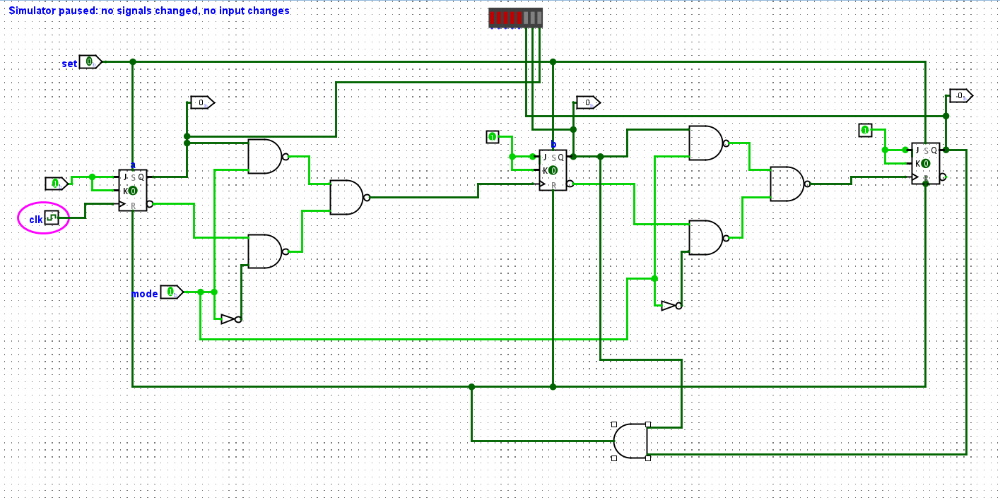

# rtl_to_gds

**Brief description:** Learning RTL to GDSII flow using Mod-N conditional counter design

---

## Table of Contents

1. [Introduction](#introduction)

---

## Introduction

Mod-N conditional counter is implementated using verilog. Mod-6 counter is taken as example to conduct functional verification of the design. 
Here is the logic design for the circuit made using Logisim.

Here is the RTL design.

[up_down_counter.v](up_down_counter.v)

Wrote a test bem
---
